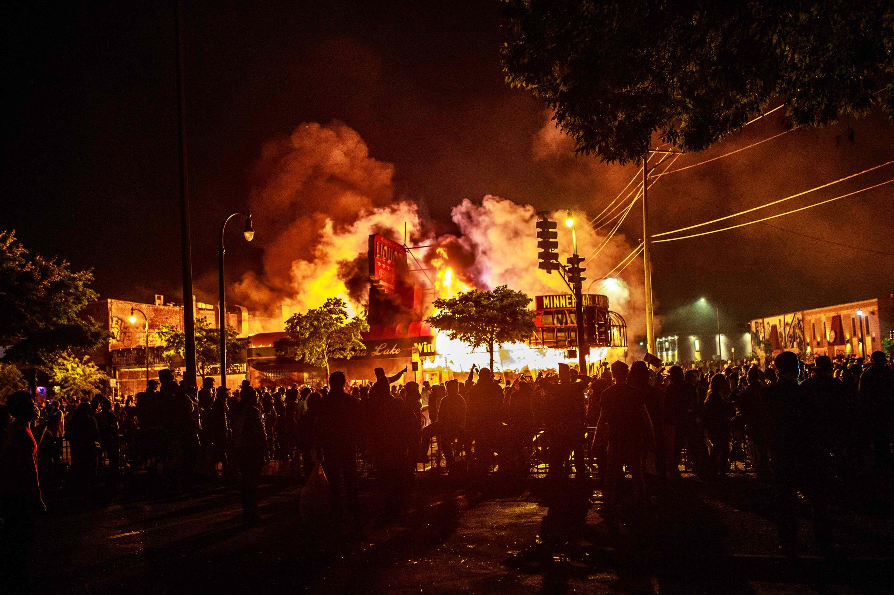

# Assignment 1: Protests
The past few years in the United States, there has been a surge in protests in support of Black Lives Matter, gender equity, and other social issues. In this assignment, you'll work with data from [CountLove](https://countlove.org/) -- the same data often [cited](https://www.nytimes.com/2020/08/28/us/black-lives-matter-protest.html) by the New York Times -- to learn more about demonstrations over the past few years.

By completing the assignment, you will demonstrate the following skills:

- Use of **version control** for managing your code
- Declaring document rendering using **markdown** syntax
- Foundational programming skills in R.

## Background Research
Before diving into this (or any) dataset, it's important to have _domain familiarity_ (i.e., to know something about the topic). As preparation, I'm asking that you read **three articles** about protests in the U.S., and provide a brief 1 - 2 sentence summary or takeaway from each one.

In the section below, create an **unordered list** of the three articles you found. Make sure to provide an appropriate markdown link (_not_ just the URL) to the article in addition to your 1 - 2 sentence summary.

- **link1:** [NewYorkTimes](https://www.nytimes.com/interactive/2020/07/03/us/george-floyd-protests-crowd-size.html)
The first article talking about **_Black Lives Matter Protests_** recently happened on June, 6, 2020, when half a million people turned out in nearly 550 places across the United States.
- **link2:** [CNN](https://edition.cnn.com/2021/01/06/politics/us-capitol-lockdown/index.html)
The second article reported **_the US Capitol protest_**, when hundreds of Trump's protesters pushed through barriers in front of the perimeter of the Capitol.
- **link3:** [NewYorkTimes](https://www.nytimes.com/article/george-floyd-protests-timeline.html)
The third article provided a timeline of **_George Floyd Protests_**, the historical markable protests happened in 2020 after the death of George Floyd on May 25 in Minneapolis.
## Accompanying Image
In this section, please **display one image** to accompany your text, and describe _why_ you included it (~2 - 3 sentences). This will require that you download an image into your project folder. In your description, use **bold** and _italics_ (at least once, for practice) to emphasize some of your points.

- **Description:** I choose this picture because it was the _largest protest_ in 2020 in my viewpoint. It was shocked while I first time saw the picture reporting on the news.

## Analysis
At this point, you should open up your `analysis.R` script to begin working with the data. The script will guide you through an initial analysis of the data. Throughout the script, there are prompts labeled **Reflection**. Please write 1 - 2 sentences for each of these reflections below:

- What does the difference between the mean and the median tell you about the *distribution* of the data?

**Answer:** The distribution of the data is _positive skewed_ since mean is **larger** than
median by **546.**
- Does the number of protests in Washington surprise you? Why or why not?

**Answer:** The number of protests in Washington surprised me because I thought **_at least 5%_** of protests in WA, but actually way less than that.

- Looking at the `state_table` variable, what data quality issues do you notice, and how would you use that to change your analysis (no need to actually change your analysis)?

**Answer:** Some states are written as lower cases which did not be included in upper case.I would add them into the upper case when doing my analysis.

- Does the change in the number of protests from 2019 to 2020 surprise you? Why or why not?

**Answer:** Yes, it did surprised me. accroding to the ratio I found, the number of protests in 2020 increased **more than twice** the number of protests in 2019.

- Do a bit of research. Find at least *two specific policies* that have been changed as a result of protests in 2020. These may be at the city, state, or University level. Please provide a basic summary, as well as a link to each article.

**link_1:**_https://www.usatoday.com/in-depth/news/2020/06/18/2020-protests-impact-city-and-state-changes-policing/5337751002/_

**policies changed:** The _most widespread change_ has been the ban on the use of **neck restraints** or **neck holds.** Generally in _two ways:_ the Strangleholds and the chokehold. They are meant to render a subject unconscious. The cities that changed this policy are including _Seattle, WA_, _Salt Lake City, UT_, _Phoenix, AZ_, _Dallas, Austin, Houston, TX_, _Greensboro, NC_, _NYC, NY_, _Washington, DC_, _Minneapolis, MN_ and etc.

**link_2:** _https://www.vera.org/policy-changes-in-us-policing_

**policies changed:** Some cities have decided to _decrease funding_ for police in municipal budgets and invest in communities and social services. Within two weeks of **George Floyd's death** in Minneapolis, the city council announced that it would **disband** the Minneapolis Police Department(MPD). On June 26, the council unanimously begin the legislative process of amending the city's charter to _replace the MPD_ with a Department of Community Safety and ViolencePrevention.

- Take a look (`View()`) your `high_level_table` variable. What picture does this paint of the U.S.?

**Answer:** By looking at the `high_level_table` variable, the **top 3** protests are _National Walkout Day_, _Women's March_, and _Families Belong Together._ The pictures painting of the U.S. at my viewpoint are: they focused a lot on fair and equity, and recently the feminism has dominated many protests, which also means they are fighting for equity as well.

## Final Thoughts
When you are finished, with your analysis, please answer the following questions in 1-2 sentences each.

- What about the analysis surprised you?

There are **a lot**, way more than I thought, protests in 2020, which is the year of the pandemic.

- What parts of this analysis did you find challenging?

I found **part 4 Dates** the most challenging because I struggled for a long time at **in_2020 and in_2019** questions.

- What types of analysis do you wish you were able to do with the dataset, but currently don't have the technical skills to do?

I wish I can figure out what types of music each user tend to listen.
